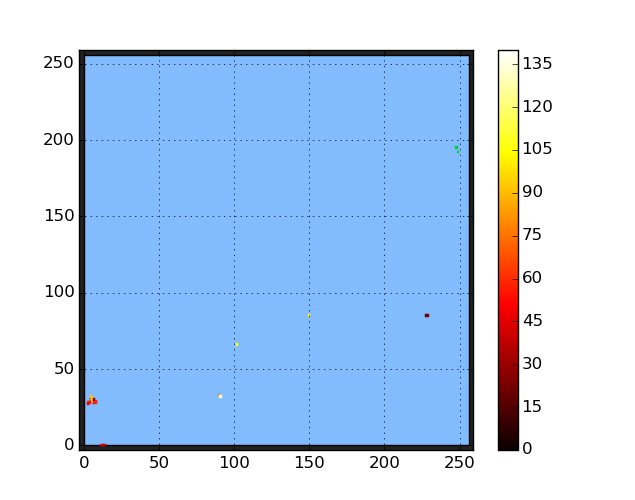

# Moving the example workflow to the grid - testing

* **Sourcing the DIRAC environment**:
You can test the DIRAC environment variables have been
set using the `echo` command.
For example:
```bash
$ echo $DIRAC
/cvmfs/ganga.cern.ch/dirac_ui/
```
If the DIRAC home directory on CVMFS is not listed, the environment
variables have not been set correctly.

* **Generating a DIRAC proxy**:
You can test if your proxy generation has been successful by
using the `dirac-proxy-info` command.

* **Successful running of the CERN@school example job**:
As with the locally-run example,
once you have run and retrieved the images from the
example job the first frame image should look something
like this:


