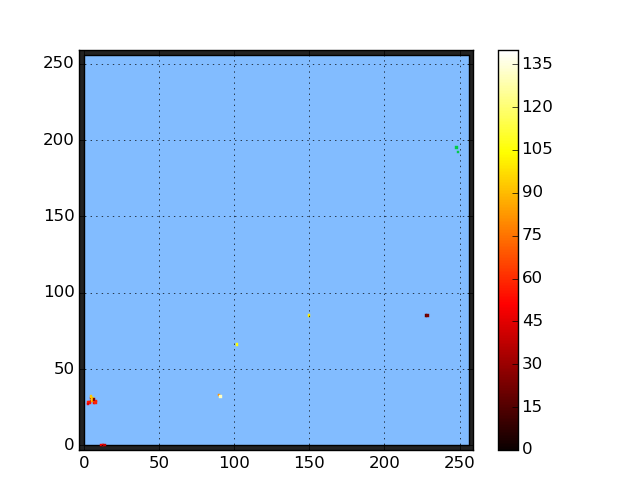

# An example workflow: local running - testing

* **Successful running of the CERN@school example job**:
Once you have run and retrieved the images from the
example job, the first frame image should look something
like this:

For reference, that's a beta particle in the bottom left
corner, and five gammas in the rest of the frame!
You can also find the source code on the
[CERN@school GitHub page](http://github.com/CERNatschool/particle-rate-plotter).
